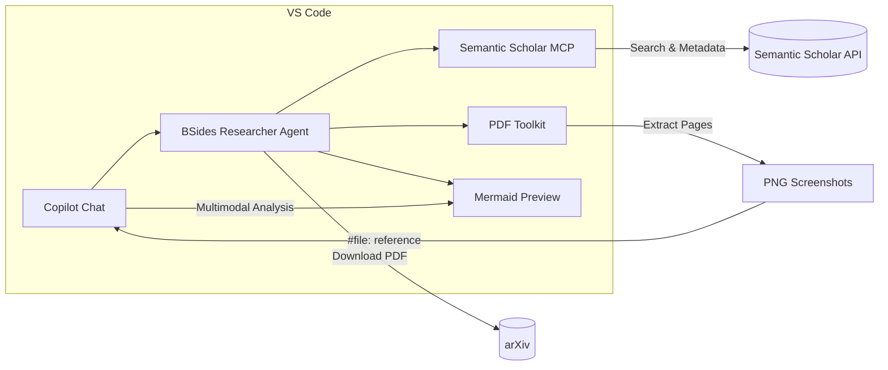

<!-- _class: title -->
<!-- _paginate: false -->
<!-- _header: '' -->
<!-- _footer: '' -->

# Fun with Agentic AI

## A "Security Operations Center" Inside VS Code

### Tim Haintz — BSides Ballarat 2026


---

<!-- _class: about -->

# About Me


**Tim Haintz** — Ballarat local 🏡

- Senior Product Manager — **Agentic AI, Microsoft Security Engineering**
- Masters in Computing by Research — **Federation University / ICSL**
  - Research: *Prompt Engineering — The Way to Talk to AI*
- Ballarat High School → University of Ballarat → Federation University
- 13 years as Systems Administrator at **Ambulance Victoria** (Ballarat)
- Creator of [**PDF Toolkit**](https://marketplace.visualstudio.com/items?itemName=TimHaintz.pdf-toolkit) — VS Code extension
- GitHub: [timhaintz](https://github.com/timhaintz)

---

# The Talk in One Sentence

> What if you could **discover, download, view, analyse, and visualise**
> security research papers — *without ever leaving VS Code?*

We'll build a **Security Research Assistant** live, using:

- **Model Context Protocol (MCP)** — the open standard for AI-tool integration
- **GitHub Copilot** — the AI brain
- **Custom VS Code extensions** — the eyes and hands
- **Agentic AI** — let the AI chain tools together autonomously

---

# The Problem

Security researchers constantly **context-switch** between:

| Task | Tool |
|---|---|
| Search for papers | Google Scholar / Semantic Scholar |
| Read PDFs | Adobe Acrobat / browser |
| Take notes | Notion / OneNote / Markdown editor |
| Draw diagrams | draw.io / Mermaid Live Editor |
| Write code | VS Code / terminal |

**5+ apps, 10+ tabs, lost context, broken flow.**

What if it was all *inside your IDE?*

---

# What is MCP?

**Model Context Protocol** — an open standard by Anthropic (now Linux Foundation)

Think of it as a **USB-C port for AI models**:

- One protocol, many tools
- Servers expose capabilities (search, data, APIs)
- Clients (VS Code, Claude, etc.) consume them
- Models can call tools dynamically

```text
┌─────────────┐     MCP      ┌──────────────────┐
│  VS Code    │◄────────────►│  Semantic Scholar │
│  (Copilot)  │     stdio    │  MCP Server       │
└─────────────┘              └──────────────────┘
```

> Today: **VS Code + GitHub Copilot + Semantic Scholar MCP**

---

# The Pipeline

## Discover → Acquire → Render → Analyse → Visualise

| Step | What happens | Tool |
|---|---|---|
| **Discover** | Search academic papers | Semantic Scholar MCP |
| **Acquire** | Download PDFs from arXiv | Agent (terminal / Node.js) |
| **Render** | Extract PDF pages as images | PDF Toolkit extension |
| **Analyse** | Multimodal AI reads the pages | GitHub Copilot (GPT-4o) |
| **Visualise** | Generate Mermaid diagrams | Markdown + Mermaid preview |

Each step feeds into the next — **the AI chains them autonomously**.

---

# Two Ways to Use It

| | Custom Agent | Chat Participant Extension |
|---|---|---|
| **Runs in** | Main VS Code window | Extension Dev Host (F5) |
| **Setup** | Clone repo, open VS Code | `npm install`, compile, F5 |
| **How** | Select from Agent picker | Type `@bsides-researcher` |
| **Commands** | Natural language | `/find`, `/download`, `/render`, `/workflow` |
| **Best for** | Daily use, portability | Polished demo, confirmation dialogs |

### Custom Agents = `.github/agents/*.md`

A Markdown file in your repo that becomes an AI agent. No code needed!

---

# The Custom Agent

`.github/agents/bsides-researcher.md`

```markdown
---
name: BSides Researcher
tools:
  - semanticScholar/*
  - editFiles
  - runCommands
  - search
  - fetch
---

You are a Security Research Assistant...

## Research Pipeline
Follow: Discover → Acquire → Render → Analyse → Visualise

### Step 1: Discover
Search using Semantic Scholar MCP tools...
```

> **That's it.** A Markdown file. Anyone who clones the repo gets the agent.

---

<!-- _class: demo -->

# 🔴 Live Demo

## Let's find and analyse some papers

---

<!-- _class: section -->

# What Just Happened?

## Let's recap the architecture

---

# Architecture Recap



**One IDE. One conversation. Full research pipeline.**

---

# Key Takeaways

1. **MCP is a game-changer** — connect any data source to any AI model
2. **Custom Agents are dead simple** — a `.md` file in your repo
3. **VS Code is the platform** — extensions + MCP + Copilot = infinite possibilities
4. **Human-in-the-loop matters** — the AI asks before acting
5. **Everything is sharable** — `git clone` and you have the same setup

---

# Try It Yourself

## Clone and go:

```bash
git clone https://github.com/timhaintz/BSidesBallarat2026.git
code BSidesBallarat2026
```

**What you need:**
- VS Code (latest)
- GitHub Copilot subscription
- Semantic Scholar API key (free)

**All config is in the repo** — `.vscode/mcp.json`, extensions, agents.

---

<!-- _class: title -->
<!-- _paginate: false -->
<!-- _header: '' -->
<!-- _footer: '' -->

# Thank You!

## Questions?

### Tim Haintz

GitHub: [timhaintz](https://github.com/timhaintz) · Repo: [BSidesBallarat2026](https://github.com/timhaintz/BSidesBallarat2026)


